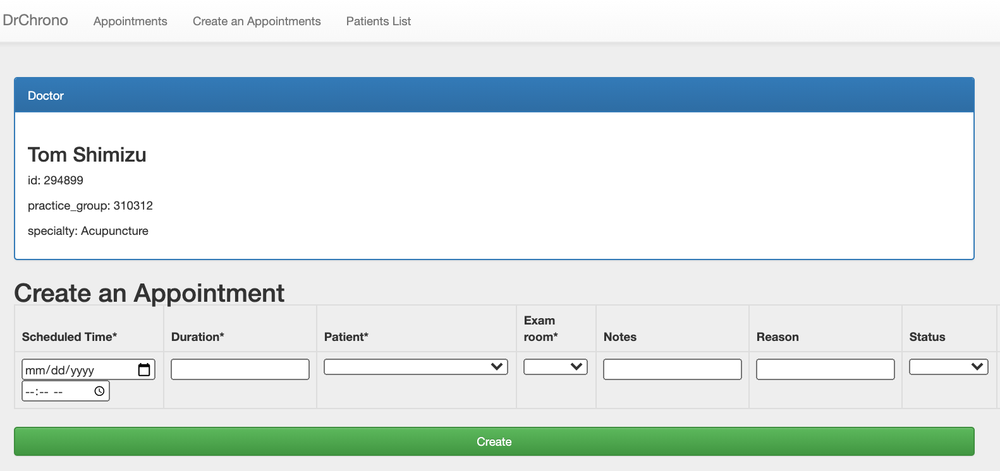

# DrChrono Hackathon (Implementation)

## Environment

```
% sw_vers
ProductName:	macOS
ProductVersion:	11.3
BuildVersion:	20E232

% pyenv --version
pyenv 1.2.27
```

## Setting up

```
git clone https://github.com/tomnt/drchrono-api-example-django drchrono/hackathon

cd drchrono
pyenv install 2.7.16
pyenv local 2.7.16
pip install virtualenv
python -m virtualenv venv
source venv/bin/activate

cd hackathon
pip install -r requirements.txt
python manage.py migrate

export SOCIAL_AUTH_CLIENT_ID=(YOUR CLIENT ID)
export SOCIAL_AUTH_SECRET=(YOUR SECRET)
```

### Patch social_core

Path
../venv/lib/python2.7/site-packages/social_core/backends/base.py

#### Before

line: 110/111

```
        for idx, name in enumerate(pipeline):
            out['pipeline_index'] = pipeline_index + idx
```

#### After

line: 110/113

```
        for idx, name in enumerate(pipeline):
            if not pipeline_index:
                pipeline_index = 0
            out['pipeline_index'] = pipeline_index + idx
```

### Authorize

```
python manage.py runserver localhost:8080
```

Click "Set up your Check-in kiosk by logging into drchrono!" at;
http://localhost:8080/setup/

## References

- [README.md(original)](readme/README.md)

# To do/Known issues

- Logout (by UserSocialAuth)
- Create a new appointment.(Invalid timestamp error)
- Can't update appointments' deleted_flag. Can't be filtered by deleted_flag.
- Check duplicated appointment(at the same time & doctor)
- Exception handling(Date range, Not found, etc)
- Sort/filter appointments & patients list.
- Submitted data cleaning
- Remove hard codings(8 working hours/day, colors, parameters, etc)
- Make executable by Docker.(ImportError: No module named parse: urllib.parse, social_core/utils.py: Maybe caused by requirements.txt fix?)
- Patient's screen
- Admin screen

# Screenshots

Appointments


Create an appointment


Patients

